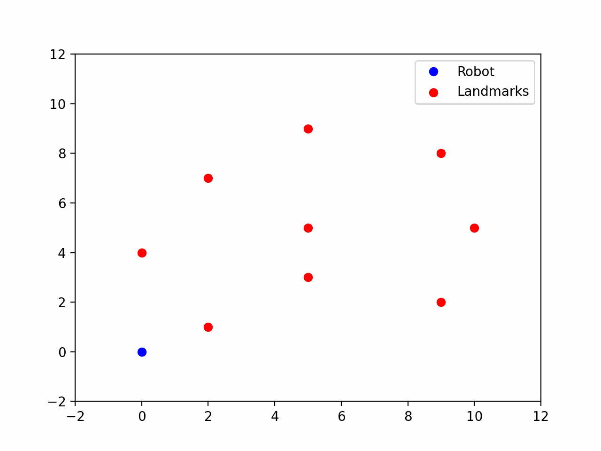

<!--
 * @Author: LOTEAT
 * @Date: 2024-07-31 11:21:01
-->
## Odometry Model Demo

This is a repository for `Odometry Motion Model`. If you want to know more about `Odometry Motion Model`, you can read a book named `Probabilistic Robotics`. Thanks to [this course](http://ais.informatik.uni-freiburg.de/teaching/ws13/mapping/index_en.php) which provides a framework.

### 1. Data Format
[This course](http://ais.informatik.uni-freiburg.de/teaching/ws13/mapping/index_en.php) provides the information of sensors and landmarks. In `sensor_data.txt`, the data is like:
```shell
ODOMETRY 0.100692392654 0.100072845247 0.000171392857486
SENSOR1 1.89645381418 0.374031885671
SENSOR2 3.85367751107 1.51951017943
ODOMETRY 0.0993660353102 0.0999680211112 -0.000241341506349
SENSOR1 1.8392269046 0.248025655056
SENSOR2 3.91387355108 1.39726707495
...
```
For the line with `ODOMETRY`, it consists of the $\delta_{rot1}, \delta_{trans}, \delta_{rot2}$. For example, in **ODOMETRY 0.100692392654 0.100072845247 0.000171392857486**, $\delta_{rot1}=0.100692392654, \delta_{trans}=0.100072845247, \delta_{rot2}=0.000171392857486$, repectively.

The followings are landmarks observed by the robot. For example, in **SENSOR1 1.89645381418 0.374031885671**, `SENSOR1` is the id of observed landmark, **1.89645381418, 0.374031885671** are the x-axis coordinate and y-axis coordinate, respectively.

Note that the data is formatted as (ODOMETRY, SENSOR, SENSOR, ODOMETRY, SENSOR, ODOMETRY, SENSOR...). Several `SENSORs` are following one `ODOMETRY`, and they are at the same timestamp.

### 2. Odometry Motion Model
The odometry motion model is as follows

$$
\left(\begin{array}{l}
x' \\
y' \\
\theta'
\end{array}\right)=
\left(\begin{array}{l}
x \\
y \\
\theta
\end{array}\right)+\left(\begin{array}{c}
\delta_{trans}cos(\theta + \delta_{rot1}) \\
\delta_{trans}sin(\theta + \delta_{rot1}) \\
\delta_{rot1} + \delta_{rot2}
\end{array}\right)
$$


### 3. Quick Start
```shell
python main.py
```

### 4. Result
The result is as follows
<center>
    
    <br>
    <div style="color:orange; border-bottom: 1px solid #d9d9d9;
    display: inline-block;
    color: #999;
    padding: 2px;">
  	</div>
</center>